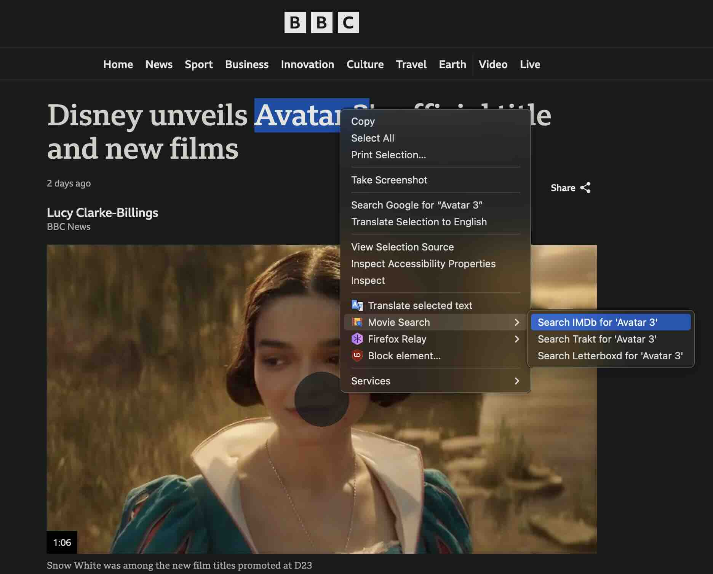

# Movie Search Context Menu Extension

This Firefox extension enhances your browsing experience by allowing you to search selected text on IMDb, Trakt, or Letterboxd directly from the context menu. Simply highlight the name of a movie or TV show on any website, right-click, and choose your preferred platform to view search results.

## Features

- **Multi-Platform Search**: Provides quick access to IMDb, Trakt, and Letterboxd search results from the context menu.
- **Simple to Use**: Just highlight text, right-click, and choose where to search.

## Installation

You can download the extension from the [Firefox Add-ons store](https://addons.mozilla.org/en-US/firefox/addon/imdb-trakt-letterboxd-search/).

## Permissions

The extension requires the following permissions:

- `contextMenus`: Allows the extension to create custom context menu items.
- `activeTab`: Enables the extension to interact with the current active tab.

### Why These Permissions Are Needed

- **`contextMenus`**: Necessary to add custom search options to the right-click menu.
- **`activeTab`**: Required to open search results in a new tab based on the selected text.

## Usage

1. Highlight the title of a movie or TV show on any webpage.
2. Right-click and scroll to the "Movie Search" option in the context menu.
3. Select "Search IMDb," "Search Trakt," or "Search Letterboxd" to view results on the respective platform.

## Contributing

Contributions are welcome! If you have any suggestions, find bugs, or would like to add features, feel free to open an issue or submit a pull request.

## Screenshot

## License

This project is licensed under the MIT License. See the [LICENSE](LICENSE) file for more details.

## Acknowledgments

- [IMDb](https://www.imdb.com/) for the movie database.
- [Trakt](https://trakt.tv/) for providing the TV and movie tracking platform.
- [Letterboxd](https://letterboxd.com/) for the movie discovery platform.
- [Mozilla](https://developer.mozilla.org/) for their documentation on Firefox extensions.
